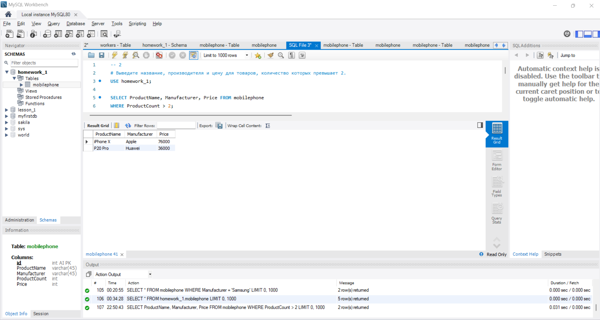
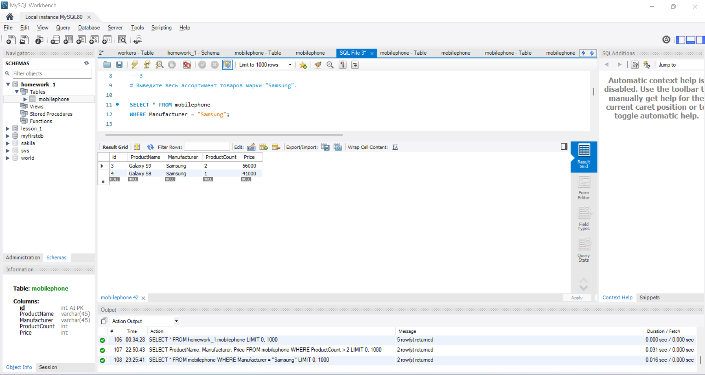
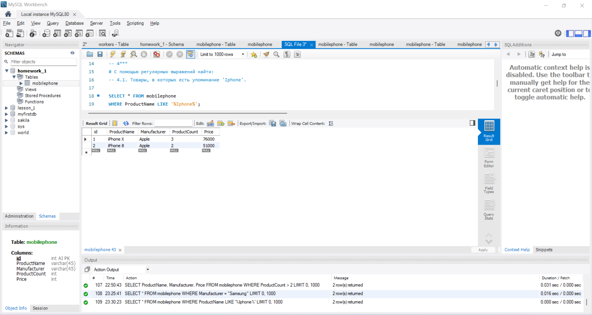
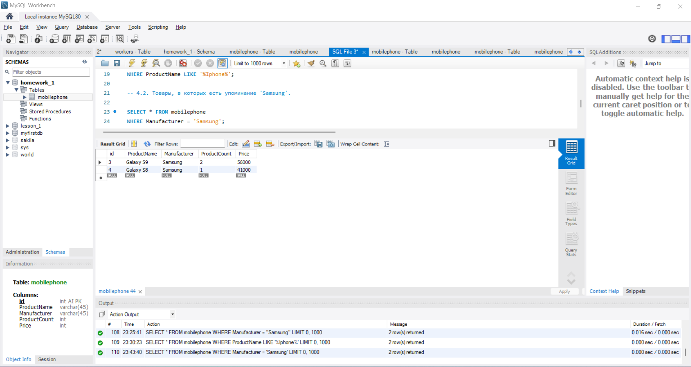
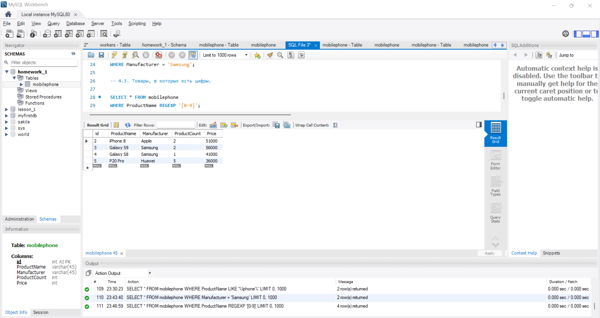
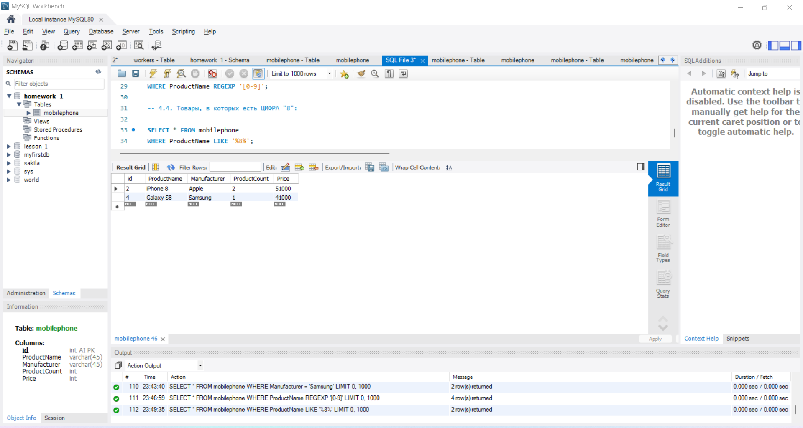

# Урок 1. Установка СУБД, подключение к БД, просмотр и создание таблиц. #

1. Создайте таблицу с мобильными телефонами, используя графический интерфейс. Заполните БД данными.

**SELECT * FROM homework_1.mobilephone;**

2. Выведите название, производителя и цену для товаров, количество которых превышает 2. 

***USE homework_1;***

***SELECT ProductName, Manufacturer, Price FROM mobilephone
WHERE ProductCount > 2;***

3. Выведите весь ассортимент товаров марки "Samsung".

***SELECT * FROM mobilephone
WHERE Manufacturer = "Samsung";***

4*. С помощью регулярных выражений найти:

- 4.1. Товары, в которых есть упоминание 'Iphone'.

***SELECT * FROM mobilephone
WHERE ProductName LIKE '%Iphone%';***

- 4.2. Товары, в которых есть упоминание 'Samsung'.

***SELECT * FROM mobilephone
WHERE Manufacturer = 'Samsung';***

- 4.3. Товары, в которых есть цифры.

***SELECT * FROM mobilephone
WHERE ProductName REGEXP '[0-9]';***

- 4.4. Товары, в которых есть ЦИФРА "8".

***SELECT * FROM mobilephone
WHERE ProductName LIKE '%8%';***

