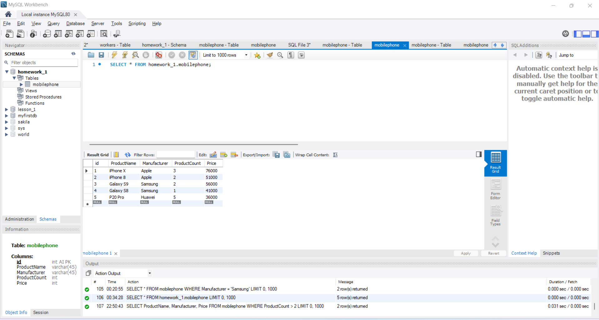

# Урок 1. Установка СУБД, подключение к БД, просмотр и создание таблиц. #

1. Создайте таблицу с мобильными телефонами, используя графический интерфейс. Заполните БД данными.

**SELECT * FROM homework_1.mobilephone;**

2. Выведите название, производителя и цену для товаров, количество которых превышает 2.

**USE homework_1;**

**SELECT ProductName, Manufacturer, Price FROM mobilephone
WHERE ProductCount > 2;**

