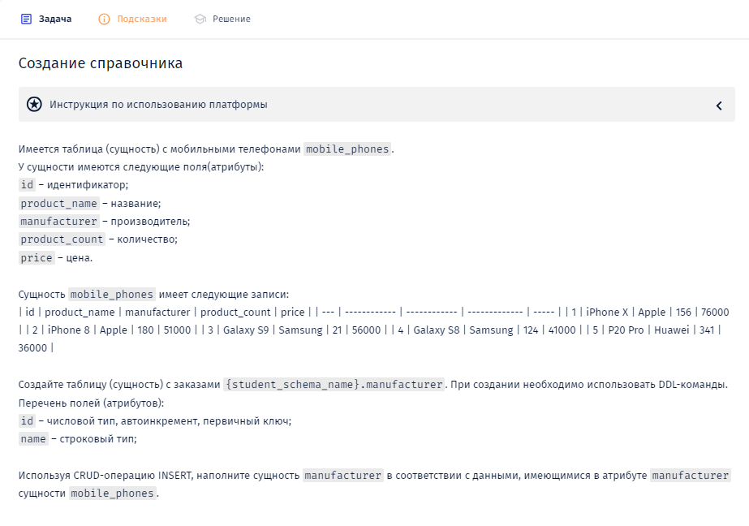
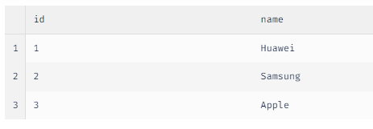

-- Вы работаете с PostgreSQL

-- При написании запросов указывайте не только имя таблицы, но и схему.

-- Название вашей схемы - itresume8002721

-- Например, itresume8002721.tablename

**Решение:**

--1. удаляем таблицу с мобильными телефонами mobile_phones, если она существует

DROP TABLE IF EXISTS itresume8002721.manufacturer;

--2. создаём таблицу с мобильными телефонами (mobile_phones)

CREATE TABLE itresume8002721.manufacturer (

    id SERIAL PRIMARY KEY,
    name VARCHAR(255)
);

--3. наполнение данными

INSERT INTO itresume8002721.manufacturer (name)

SELECT DISTINCT manufacturer
FROM mobile_phones;

SELECT * FROM itresume8002721.manufacturer;

