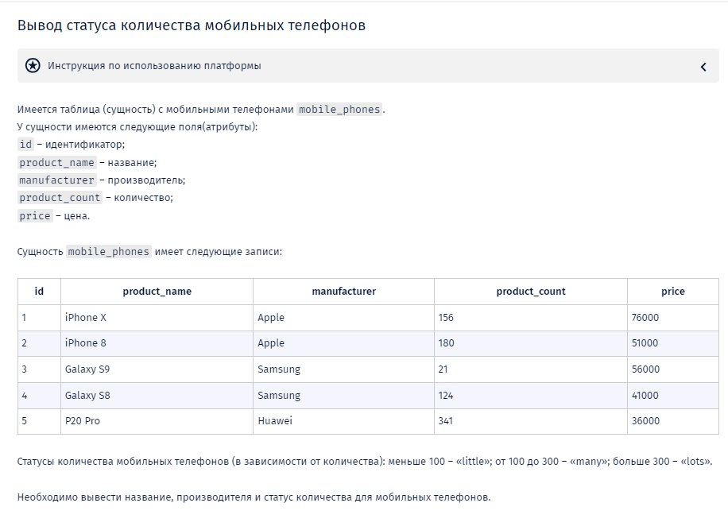
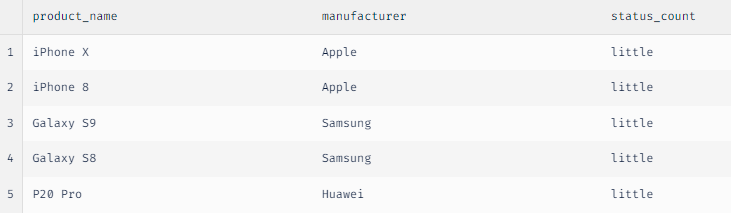

-- Вы работаете с MySQL

-- При выводе статуса не следует создавать новый атрибут сущности mobile_phones. Нужно воспользоваться оператором CASE или функцией IF. Псевдоним для вычисляемого поля status_count.

-- В случае если количество не соответствует ни одному статусу нужно вывести «unspecified».

-- При выводе атрибутов соблюдайте порядок вывода, указанный в задаче.

**Решение:**

1. SELECT product_name, manufacturer,

    CASE

        WHEN product_count < 100 THEN 'little'
        WHEN product_count BETWEEN 100 AND 300 THEN 'many'
        WHEN product_count > 300 THEN 'lots'
        ELSE 'unspecified'

    END AS status_count

FROM 

    mobile_phones;

2. 
SELECT 

`product_name`,

`manufacturer`,

CASE 

WHEN product_count<100 THEN 'little'

WHEN product_count between 100 AND 300 THEN 'many'

WHEN product_count>300 THEN ' lots'

ELSE 'unspecified'

END AS `status_count` 

FROM `mobile_phones`;

