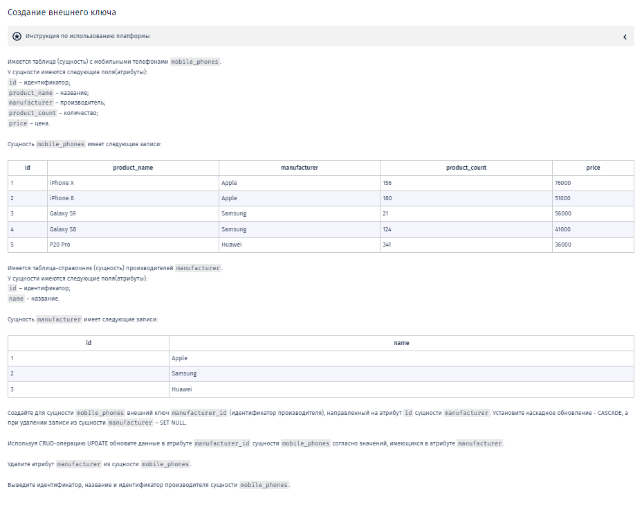
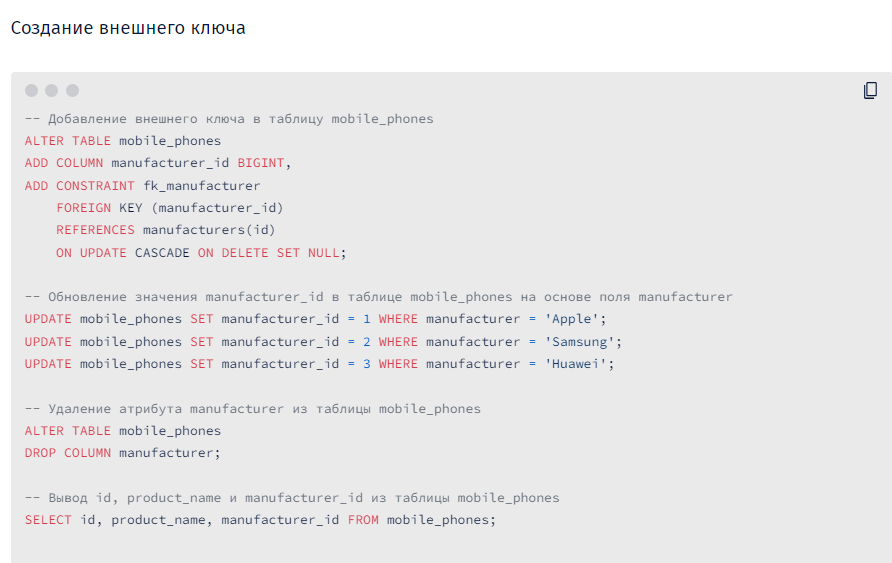

-- Вы работаете с PostgreSQL

-- При написании запросов указывайте не только имя таблицы, но и схему.

-- Название вашей схемы - itresume8002721

-- Например, itresume8002721.tablename

**Решение:**

