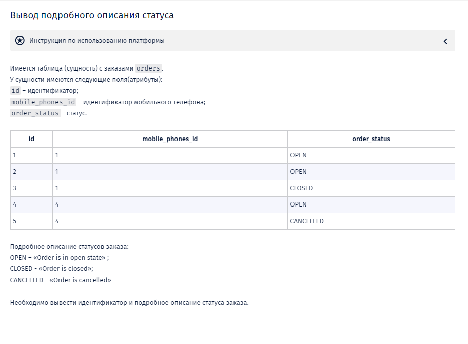
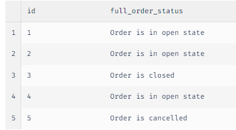

-- Вы работаете с MySQL

-- При выводе статуса не следует создавать новый атрибут сущности orders. Нужно воспользоваться оператором CASE или функцией IF. Псевдоним для вычисляемого поля full_order_status.

-- В случае если количество не соответствует ни одному статусу нужно вывести «unspecified».

-- При выводе атрибутов соблюдайте порядок вывода, указанный в задаче.

SELECT 

    id,
    CASE 
        WHEN order_status = 'OPEN' THEN 'Order is in open state'
        WHEN order_status = 'CLOSED' THEN 'Order is closed'
        WHEN order_status = 'CANCELLED' THEN 'Order is cancelled'
        ELSE 'unspecified'
    END AS full_order_status
FROM 

    orders;

